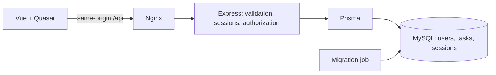

# Taskflow

A task management application for the Vue / Node.js / MySQL assignment, including authentication and containerization. Each account has its own tasks, persisted in MySQL.

**Stack:** Vue 3, Quasar, TypeScript, Vite, Pinia, Vue Router, Axios, Node 24, Express 5, Prisma 7, MySQL 8.4 LTS, Nginx, Docker Compose.

## Quick start

Install Docker Desktop with Linux containers and Docker Compose **2.24.4+**. Local Node/MySQL installations are not needed to run the application. Run from this repository's root:

```powershell
Copy-Item .env.example .env
docker compose up --build -d --wait
```

On macOS/Linux, use `cp .env.example .env`. Keep an existing `.env` instead of overwriting it. Initial image downloads and builds can take several minutes.

Open **http://localhost:8080**.

**Demo credentials:** `demo@taskflow.local` / `TaskflowDemo!2026`.

Register another account to try a private empty workspace. Demo seeding is optional and creates the sample account/tasks once; it does not reset existing data.

```powershell
docker compose ps
docker compose logs api
docker compose down
```

`down` retains the MySQL volume. Adding `-v` deletes data. MySQL initialization credentials apply only when a volume is first created; changing `.env` does not change existing database users. If port 8080 is occupied, change both `WEB_PORT` and `PUBLIC_ORIGIN`; change `MYSQL_PORT` if 3306 is occupied.

## Features

| Requirement          | Implementation                                                                                                       |
| -------------------- | -------------------------------------------------------------------------------------------------------------------- |
| Friendly task UI     | Responsive desktop table/mobile cards, summaries, search, status/priority filters, sorting, pagination, empty states |
| Add tasks            | Validated title, description, status, priority, optional due date                                                    |
| Edit/delete          | Shared add/edit form, completion shortcut, deletion confirmation                                                     |
| Backend integration  | Axios → Express → Prisma → MySQL; tasks survive reloads                                                              |
| Loading/errors       | Skeletons, busy actions, field errors, network retry, preserved failed-save drafts                                   |
| Authentication bonus | Register, login, logout, restored sessions, server-side task ownership                                               |
| Docker bonus         | Built SPA, proxy, nonroot API, migration job, persistent MySQL, health checks                                        |

## Architecture and decisions



- **Vue + Quasar:** Vue is the requested stack and Quasar is preferred in the brief. Reactive components fit changing task lists/forms; Quasar supplies consistent forms, tables, dialogs, busy buttons, and notifications. React/Angular or Vuetify/PrimeVue are valid alternatives when an existing team stack/design system calls for them. Quasar adds component conventions and dependencies. The official Vite plugin fits this browser SPA; other deployment targets could justify Quasar CLI.
- **Express REST:** CRUD maps directly to HTTP methods and status codes. Small auth/task feature modules keep the code easy to follow. NestJS or additional service layers would make more sense as business rules/team size grow.
- **Prisma + MySQL:** Typed queries, constraints, transactions, indexes, and committed migrations meet the persistence requirement. Sequelize/direct SQL are valid alternatives; Prisma introduces generation and adapter configuration. Locked Prisma 7 versions retain the selected MySQL compatibility; dependency overrides resolve reported transitive advisories.
- **Database sessions:** An HttpOnly cookie references an opaque MySQL session. This browser app benefits from simple restoration and immediate logout revocation. JWT access/refresh tokens would add rotation/revocation coordination; Redis would add another service. Sessions require database access and CSRF protection.
- **Confirmed writes:** Success is shown after the backend saves. Failed drafts remain intact. Optimistic writes could improve perceived speed but need rollback/reconciliation; mutations are not automatically retried because lost responses can lead to duplicate writes.
- **Calendar dates and bounded queries:** Due dates use MySQL `DATE` and API `YYYY-MM-DD`. Overdue uses the current UTC day. Pages are bounded to 100 rows; deep offsets/contains search may need cursor pagination/full-text search at larger scale. Concurrent edits currently use last write wins.
- **Containers:** Nginx serves the built SPA and proxies `/api`, avoiding cross-origin cookie setup. SQL readiness gates migrations, successful migrations gate API startup, and API health gates web startup. Multi-stage builds keep build tools out of the nonroot distroless API runtime.

Pinia shares authentication; task queries/drafts stay in their components. The API port is not published. Web and optional MySQL development ports bind to loopback by default. The MySQL application account is separate from root.

## API

JSON responses, except successful deletion/logout (`204`). Auth/task responses use `Cache-Control: no-store`.

| Method | Path                 | Behavior                                     |
| ------ | -------------------- | -------------------------------------------- |
| GET    | `/api/health`        | Checks MySQL connectivity; `200` or `503`    |
| GET    | `/api/auth/session`  | Public user or null, plus CSRF token         |
| POST   | `/api/auth/register` | Creates account and signs in                 |
| POST   | `/api/auth/login`    | Verifies credentials and regenerates session |
| POST   | `/api/auth/logout`   | Destroys session and clears cookie           |
| GET    | `/api/tasks`         | Owner-scoped filtered/paginated list         |
| GET    | `/api/tasks/summary` | Owner's total/status/overdue counts          |
| GET    | `/api/tasks/:id`     | Reads an owned task                          |
| POST   | `/api/tasks`         | Creates an owned task; `201`                 |
| PATCH  | `/api/tasks/:id`     | Updates supplied allowed fields              |
| DELETE | `/api/tasks/:id`     | Deletes an owned task; `204`                 |

For Postman/scripts, first GET `/api/auth/session`, retain its cookie, and send the returned token in `X-CSRF-Token` on every mutation, including login/register. Use the replacement cookie/token after authentication.

Task input:

```json
{
  "title": "Prepare the next sprint",
  "description": "Agree on priorities and milestones.",
  "status": "IN_PROGRESS",
  "priority": "HIGH",
  "dueDate": "2026-10-15"
}
```

Statuses: `TODO`, `IN_PROGRESS`, `DONE`. Priorities: `LOW`, `MEDIUM`, `HIGH`. Title: 1–200 trimmed characters; description: up to 5,000; due date: valid calendar day or null. PATCH requires at least one field and preserves omitted values. Owners are assigned by the server; unexpected fields are rejected.

List parameters: `page`, `pageSize` (default 10, max 100), `search`, `status`, `priority`, `sortBy`, `order`. Allowed sort fields: `updatedAt`, `createdAt`, `title`, `dueDate`, `priority`, `status`; order is `asc`/`desc`. Response: `{ items, total, page, pageSize }`.

Errors use `{ code, message, details? }`. Validation: `422`; duplicate email: `409`; unauthenticated: `401`; invalid CSRF: `403`; absent/foreign task: `404`; malformed JSON: `400`; oversized body: `413`; throttled: `429`; unexpected failure: generic `500`.

## Local development

Install **Node 24**. Configure the backend database connection before generating Prisma/building outside Docker:

```powershell
npm run install:all
docker compose up -d db
Copy-Item backend/.env.example backend/.env
```

Match `backend/.env` database credentials/port to root `.env`. Development uses `PUBLIC_ORIGIN=http://localhost:5173`. Encode special characters in manually written connection URLs.

```powershell
npm --prefix backend run db:deploy
npm --prefix backend run generate
npm --prefix backend run dev
```

In another terminal:

```powershell
npm --prefix frontend run dev
```

Open http://localhost:5173. Vite proxies `/api` to the backend. For schema changes, create a named migration with `npm --prefix backend run db:dev -- --name change_name` and commit it. Development migration needs an appropriately configured shadow database/account. Runtime accounts should not have global administration privileges. Delivery uses `migrate deploy`, not `db push` or `migrate dev`.

## Testing and workflow

Develop a change by defining its behavior, adding a migration only if needed, implementing validated owner-scoped API operations, connecting loading/success/failure UI states, and adding relevant regression tests.

```powershell
npm run check
npm run build
npm run security:audit
npm test
```

`check` covers formatting, script syntax, types, and lint. Prisma generation needs connection configuration even without contacting MySQL. `npm test` uses real Express/Prisma/MySQL in an isolated `_test` database; cleanup refuses a non-test configuration.

Browser tests create accounts/tasks, so use the disposable instance rather than personal data:

```powershell
npm run stress:prepare
npm --prefix frontend exec -- playwright install chromium
$env:E2E_BASE_URL = 'http://localhost:8082'
npm run test:e2e
Remove-Item Env:E2E_BASE_URL
npm run stress:down
docker compose --profile test stop db-test
```

macOS/Linux: `E2E_BASE_URL=http://localhost:8082 npm run test:e2e`. Chromium needs its system dependencies on Linux (`playwright install --with-deps chromium`). Do not run browser/load tests concurrently against the same disposable stack.

Performance profiles run individually:

```powershell
npm run test:smoke
npm run test:load
npm run test:stress
```

The runner starts a separate localhost:8082 stack, seeds 200 accounts/4,000 baseline tasks, runs k6, audits records/session cleanup, probes HTTP 429 boundaries/logout, writes reports under ignored `artifacts/stress/`, and tears down. Fixture scripts require exactly `taskmanager_stress`. Capacity limits are raised only in this disposable stack; separate production-mode probes test throttling. `npm run stress:down` cleans up an interrupted run.

| Recorded local verification, 3 October 2026 | Result                                                                                     |
| ------------------------------------------- | ------------------------------------------------------------------------------------------ |
| Backend                                     | 27 passing: 18 real DB/API, 6 validation, 3 configuration                                  |
| Browser                                     | 14 passing: 7 behaviors × desktop/Pixel 7 Chromium emulation                               |
| Latest post-security stress                 | 200 peak virtual users, 46,540 workload requests, 7,615 journeys, zero unexpected failures |
| Workload request latency                    | p95 500.11 ms; p99 778.34 ms                                                               |
| Integrity/recovery/throttling               | Passed                                                                                     |

The stress schedule is 115 seconds with a 20-second peak hold. It is closed-loop authenticated CRUD with sequential setup logins, a 4,000-task tmpfs database, and generator/API/DB sharing a local 12-CPU/~11.3 GiB Docker host. Results do not guarantee production capacity, simultaneous login performance, browser rendering speed, or a long soak. p95 is a request-duration percentile, not a maximum or whole-journey duration.

Tests cover ownership, CSRF, session rotation/logout/expiry, real persistence, safe partial edits, validation, failed-save draft retention, retry, filtering, lost-session routing, security headers, CSP, and stored HTML escaping. Mobile coverage is emulation, not a physical-device or cross-browser audit.

GitHub Actions is configured for push/PR verification, manually selected performance profiles, and weekly runtime-image scans. Dependabot proposes updates. Hosted workflows have not been executed from this workspace; the table describes local evidence.

## Security and deployment

- Argon2id password hashes (19 MiB, 2 iterations, parallelism 1); registration passwords 15–128 characters. Normalized unique emails; passwords/hashes are not returned.
- HttpOnly, SameSite=Lax cookies; rolling 24-hour idle session expiry; ID/CSRF regeneration on login; server-side logout revocation; expired-session cleanup.
- Session-bound CSRF headers, origin checks, strict Zod inputs, owner filters on every task operation, controlled errors, and a 32 KiB JSON limit.
- Vue renders task text without HTML interpretation. Nginx CSP blocks inline JavaScript and frames; inline styles remain allowed for Quasar. Helmet and consistent gateway headers provide additional protection.
- General API quota: 300/minute/IP; login/register: 20/15 minutes/IP. Logout stays outside the credential quota but still obeys the general quota and CSRF. Limits are in-process; replicas need a shared limiter.
- Nginx overwrites forwarded client IP; Express trusts one proxy hop. Review that trust model before changing topology or exposing the API directly.

Corrections implemented and covered by regression/build verification:

| Fix    | Correction                                                                                               |
| ------ | -------------------------------------------------------------------------------------------------------- |
| SEC-01 | Unknown-account login verifies a dummy Argon2 hash to remove the obvious early-return timing discrepancy |
| SEC-02 | Shared Nginx security headers included where location-level cache headers otherwise drop inheritance     |
| SEC-03 | Loopback demo bindings; reject unsafe non-loopback production settings                                   |
| SEC-04 | Login/register quota no longer independently blocks logout                                               |
| SEC-05 | Nonroot distroless API runtime removes unused OS/npm tooling                                             |
| SEC-06 | Nginx vendor packages updated during build                                                               |
| SEC-07 | MySQL 8.4 LTS replaces the older database line                                                           |
| SEC-08 | Remove unused MySQL Shell; rebuild upstream gosu with patched dependencies                               |
| SEC-09 | Frontend/backend enforce the 15-character new-password minimum                                           |

At the recorded Trivy review, API findings changed from 270 to 31, Nginx from 4 to 0, and MySQL from 239 to 0, with zero high/critical findings in final runtimes. Counts are package/advisory pairs, not remotely exploitable routes. The API's **23 medium and 8 low upstream findings remain open**, without a vendor fix reported at that review. Root/backend/frontend npm audits reported zero findings then. Rescan refreshed images; results are time-specific.

Public hosting needs real HTTPS termination, correct trusted HTTPS forwarding, an exact `PUBLIC_ORIGIN`, strong database/session secrets, `COOKIE_SECURE=true`, and `SEED_DEMO=false`. Startup guards check these application settings but do not deploy TLS, monitoring, or backups. Never publish `.env`, database dumps, or session credentials. Existing password hashes are not strengthened by the new-registration length rule. Registration intentionally reveals unavailable emails through `409`; login timing is not perfectly identical. This is not an independent penetration test.

Scope is personal tasks. Password recovery, MFA, email verification, team roles, realtime/offline synchronization, edit versioning, deployed monitoring, and high availability are not implemented.
